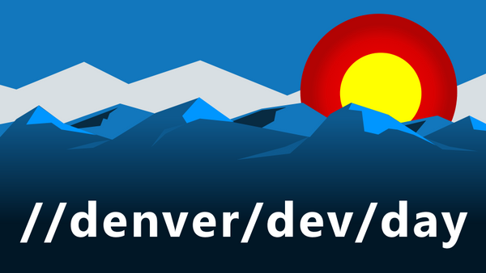

# We're back

We had to cancel our 2020 and 2021 events. But not this time! Welcome to October 2022 Denver Dev Day.

## What is Denver Dev Day?

Denver Dev Day is Colorado’s best, community-led developer event! Enjoying every topic that can impact developers from desktop to database, devops to developer tools, web, mobile, machine learning and soft skills. Denver Dev Day has seen it all and welcomes innovative content.

## Where is it?

Microsoft is a recurring sponsor for Denver Dev Day and has provided our venue space for nearly 6+ years. 
We're grateful for their continued sponsorship; find out more about our great venue in the event site details. 

## Thank you for considering Denver Dev Day

Denver Dev Day welcomes you. As a speaker at Denver Dev Day, you get the opportunity to speak to a 
thoughtful audience of bright technologists and eager developers from a thriving local community. 
This is our thirteenth Denver Dev Day.  

## Who should submit talks? 

We welcome any and all to speak at our event and actively encourage under-represented groups to 
submit talks and participate in the event. We are conginually working with a number of groups to 
promote inclusivity and diversity at our conference. All submissions are welcome.

## What level should your talk be?

The most successful talks are often level 100 or 200 talks. That does not mean you cannot submit
and advanced talk. It's just lower level talks tend to reach a broader audience. It is up to you.

## How many talks can you submit? 

As many as you like. We generally only choose one (maybe two) per speaker. If you are traveling to Denver, 
be sure to let us know. We'll consider multiple sessions for speakers traveling to Denver Dev Day.

## What topic should your talk cover? 

We have several tracks, like: Client, Web, Data and Cloud. If you can't fit your topic in one of those, 
we'll create a track for you. We're open to new ideas, but, remember the dev in Denver Dev Day is for Developer.

**Tip:** we love talks on design patterns and development techniques.

$$ How long should your talk be? 

We have two session lengths: regular and lightning. Regular sessions are just under an hour depending 
how many sessions are accepted; lightning talks are 10 to 15 minutes depending on how many talks are accepted. 

**Tell us:** anything special with your talk? (time of day you are available, unique facility set-up, etc.)

_We look forward to seeing your submission._

-- The Denver Dev Day planning team.

# Frequently asked questions

1. Is this an online event? `No`
1. Is this a hybrid event? `No`
1. Is this an in-person event? `Yes!`
1. Is this a Microsoft event? `No`
1. Is this a free event? `Yes!`
1. Is this a Developer-oriented event? `Yes!`
1. Is this for a certain technology? `No`
1. Is this event in Denver? `Yes!`
1. Is this event multiple days? `No`

**About you**

10. Does this event pay speakers? `No`
1. Does this event _want to_ pay speakers? `Yes!`
1. Does this event reimburse travel costs? `No`
1. Does this event _want to_ reimburse travel costs? `Yes!`
1. Is this a scrappy, community-led event? `Yes!`
